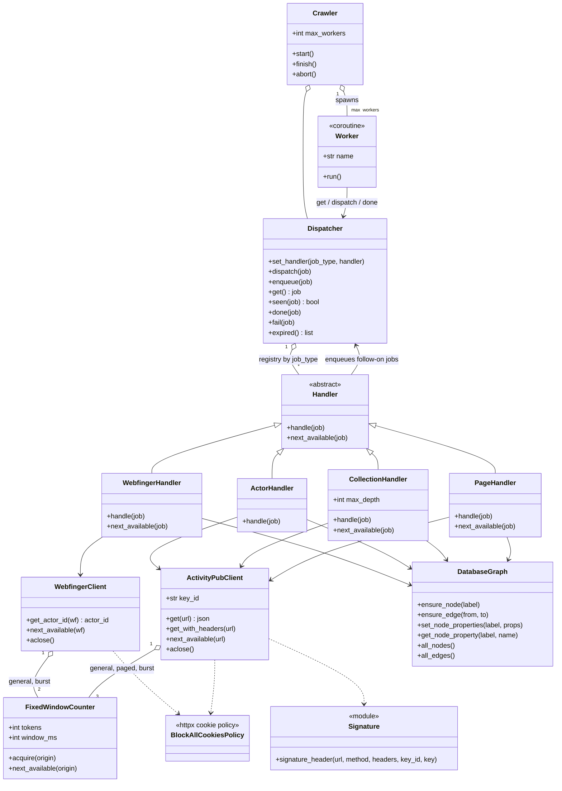
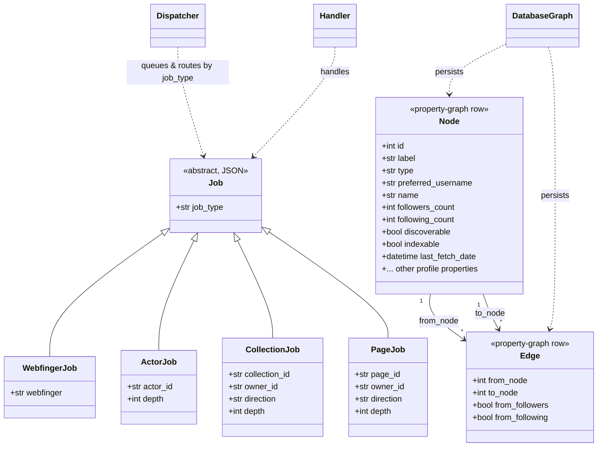

# Architecture of PubCrawler

This is a [4+1 architectural view model](https://en.wikipedia.org/wiki/4%2B1_architectural_view_model) for the PubCrawler system.

## Use cases

### Personae

- Crawler operator: runs the crawl
- Data analyst: determines properties of the network
- Server operator: runs a server
- Fediverse user: has an account on the Fediverse

## Process

## Logical

The jobs that flow through the queue, and the graph they build, are conceptual
classes even though jobs are plain JSON and nodes/edges are property-graph rows.

## Development

## Physical
