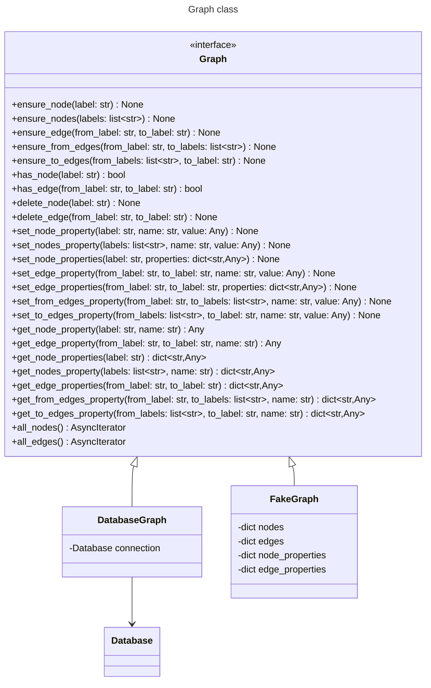

# Graph

```mermaid
---
title: Graph class
---
classDiagram
    class Database
    class Graph {
        <<interface>>
        +ensure_node(label: str) None
        +ensure_nodes(labels: list~str~) None
        +ensure_edge(from_label: str, to_label: str) None
        +ensure_from_edges(from_label: str, to_labels: list~str~) None
        +ensure_to_edges(from_labels: list~str~, to_label: str) None
        +has_node(label: str) bool
        +has_edge(from_label: str, to_label: str) bool
        +delete_node(label: str) None
        +delete_edge(from_label: str, to_label: str) None
        +set_node_property(label: str, name: str, value: Any) None
        +set_nodes_property(labels: list~str~, name: str, value: Any) None
        +set_node_properties(label: str, properties: dict~str,Any~) None
        +set_edge_property(from_label: str, to_label: str, name: str, value: Any) None
        +set_edge_properties(from_label: str, to_label: str, properties: dict~str,Any~) None
        +set_from_edges_property(from_label: str, to_labels: list~str~, name: str, value: Any) None
        +set_to_edges_property(from_labels: list~str~, to_label: str, name: str, value: Any) None
        +get_node_property(label: str, name: str) Any
        +get_edge_property(from_label: str, to_label: str, name: str) Any
        +get_node_properties(label: str) dict~str,Any~
        +get_nodes_property(labels: list~str~, name: str) dict~str,Any~
        +get_edge_properties(from_label: str, to_label: str) dict~str,Any~
        +get_from_edges_property(from_label: str, to_labels: list~str~, name: str) dict~str,Any~
        +get_to_edges_property(from_labels: list~str~, to_label: str, name: str) dict~str,Any~
        +all_nodes() AsyncIterator
        +all_edges() AsyncIterator
    }
    class DatabaseGraph {
        -Database connection
    }
    DatabaseGraph --> Database
    class FakeGraph {
        -dict nodes
        -dict edges
        -dict node_properties
        -dict edge_properties
    }
    Graph <|-- DatabaseGraph
    Graph <|-- FakeGraph
```
