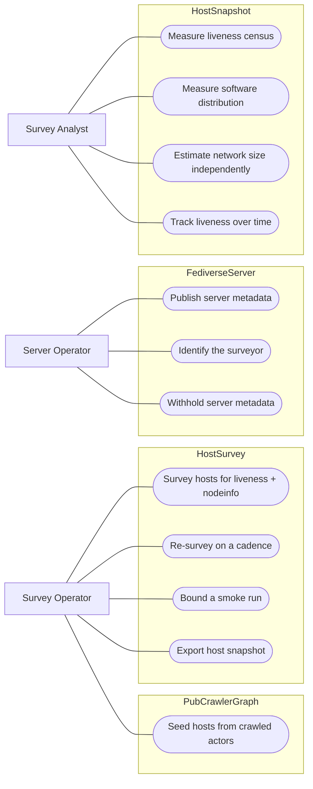
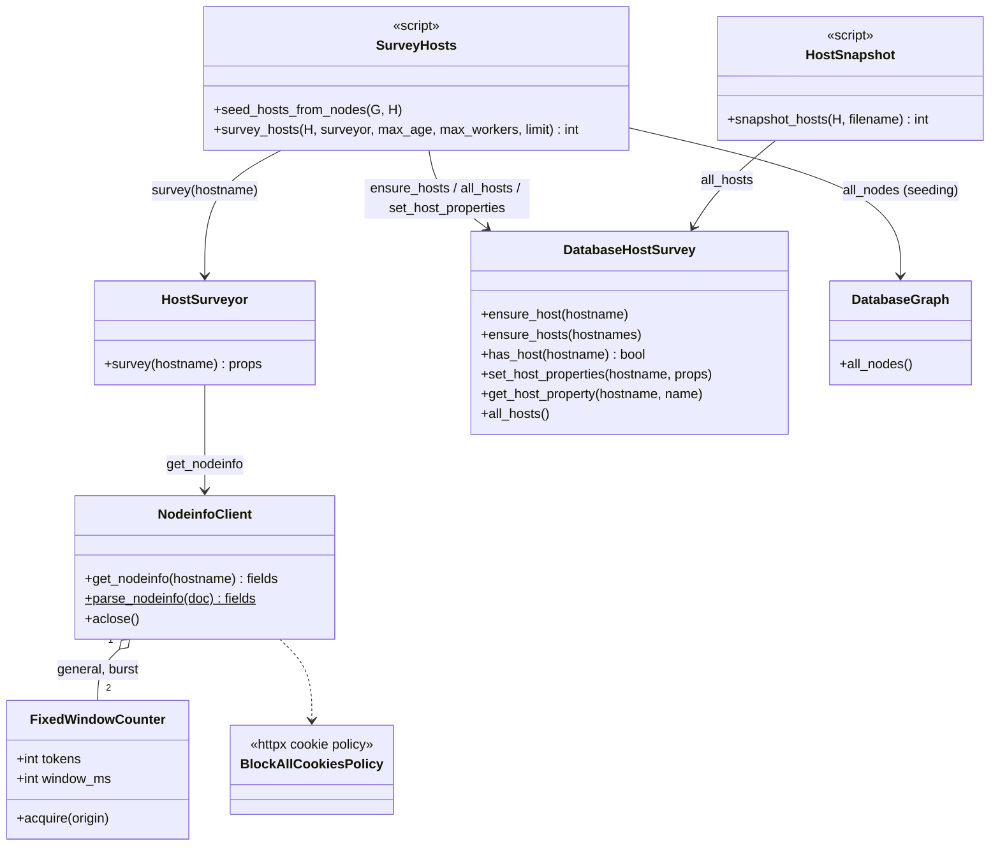
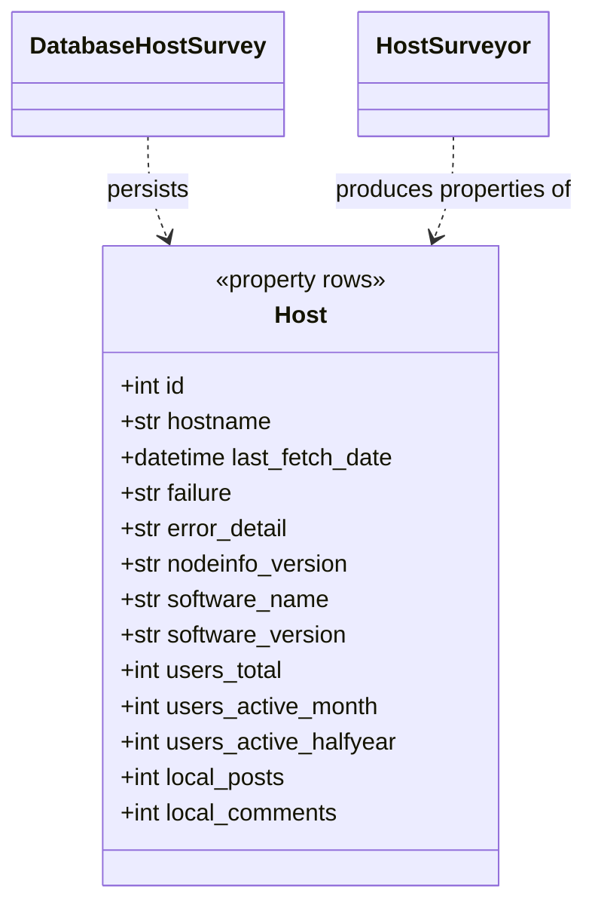
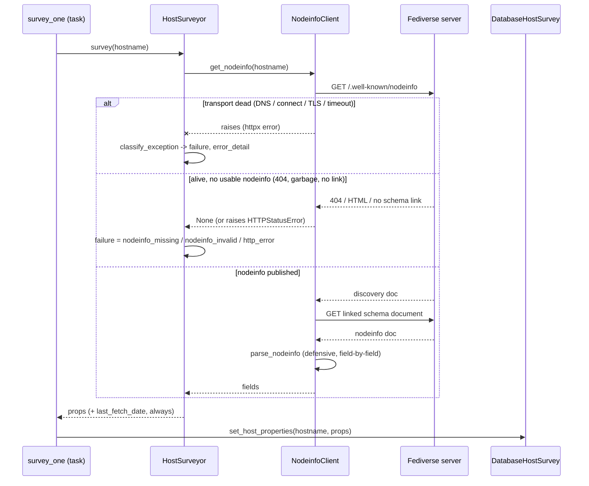
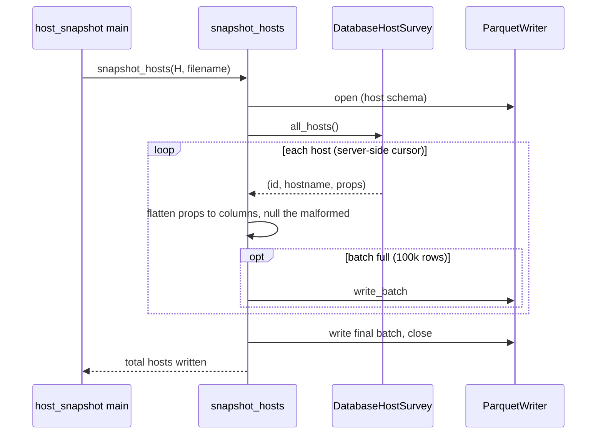
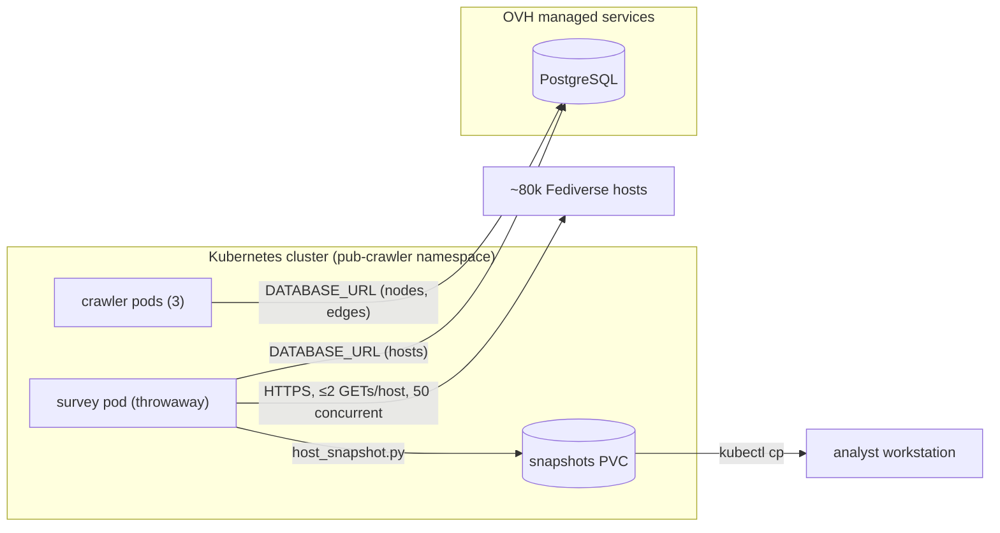

# Architecture of the Host Survey

This is a [4+1 architectural view model](https://en.wikipedia.org/wiki/4%2B1_architectural_view_model)
for the host survey: the server-by-server companion to PubCrawler's
actor-by-actor crawl. It probes every distinct hostname seen in the crawl for
liveness and nodeinfo metadata, storing results as host properties in the
same database.

The survey stores no per-person data: only server-level metadata that a
server operator publishes via [nodeinfo](https://nodeinfo.diaspora.software/)
(software, version, aggregate usage counts) and the survey's own liveness
classification. There is therefore no "Fediverse user" persona here, unlike
the crawl's use cases.

## Use cases

### Personae

- Survey operator: runs the survey against the crawl's hosts
- Server operator: runs a Fediverse server and controls what it publishes
- Survey analyst: measures properties of the server population



## Logical

The survey reuses the crawl's client construction idioms (rate-limit
counters, cookie blocking, timeouts) but runs its own pipeline: two bin
scripts orchestrate a probe class, a fetch/parse client, and the host
container, alongside — not inside — the graph.



The hosts the survey builds are conceptual rows, like the crawl's nodes and
edges: a `host` row plus `host_property` rows, written only when a value is
known (absence means unknown; a host with no `last_fetch_date` has never
been surveyed).



The `failure` property doubles as the liveness classification:
`dns_error`, `connect_error`, `tls_error`, and `timeout` mean the transport
is dead; `nodeinfo_missing`, `nodeinfo_invalid`, and `http_error` mean the
server is alive without usable nodeinfo; no `failure` at all means the host
was fully surveyed and the nodeinfo fields are populated.

## Process

A survey run is two sequential passes and one concurrent phase:

1. **Seed** (skippable with `--no-seed`): stream every node label from the
   graph, extract distinct hostnames (~80k from ~6.2M labels), and ensure
   them into the host table in batches. Conflict-ignoring, so only hosts new
   since the last run are added.
2. **Scan**: stream all hosts and keep those whose `last_fetch_date`
   property is absent (never surveyed) or older than `--max-age` (default
   1d). `--limit` caps the list for smoke runs.
3. **Survey**: one task per due host, bounded by a semaphore of
   `--max-workers` (default 50). Each task probes its host and saves the
   result immediately — per-host saves are the resume granularity, so a
   killed run loses nothing: hosts not yet saved are still due on the next
   run. One host's failure is logged and never aborts the rest.

Politeness: at most 2 GETs per host per run (nodeinfo discovery + the
linked schema document), transports built with `retries=0` (a dead host
costs one 5-second connect timeout, not four), the crawler's per-origin
rate-limit counters, and the identifying User-Agent with a contact email.
Dead-host timeouts dominate the wall clock: ~80k hosts at 50 workers is a
1–3 hour run.

One host's survey, all three outcome shapes:



Every outcome — including every failure — stamps `last_fetch_date`, so a
failed host is not retried until it goes stale like any other. Re-running
the survey on a cadence therefore converges to one probe per host per
`--max-age` window, with liveness history accumulating across snapshots.

The snapshot export is a single streaming pass: hosts flow off a server-side
cursor, properties are flattened into typed columns (ISO `last_fetch_date`
parsed to a UTC timestamp, counts bounds-checked, anything malformed nulled
without aborting — the crawl snapshot's `published` lesson), and rows are
written in batches:



## Development

The survey adds two library modules, one container module, and two scripts
to the existing package — no new package structure. Arrows are imports;
the surveyor takes its client by injection (constructor argument), so it
depends only on the client's behavior, not its module.

```mermaid
flowchart TD
    subgraph bin
        sh["survey_hosts.py"]
        hs["host_snapshot.py"]
    end
    subgraph pub_crawler
        surveyor["host_surveyor.py"]
        client["nodeinfo_client.py"]
        container["database_host_survey.py"]
        graph["database_graph.py"]
        migrations["database.py (migrations)"]
        throttle["throttle.py / fixed_window_counter.py"]
    end

    sh --> surveyor
    sh --> client
    sh --> container
    sh --> graph
    sh --> migrations
    sh --> throttle
    hs --> container
    surveyor -.->|injected| client
```

Development is test-driven: each module's test suite was written first and
defines its contract (the suite docstrings are the specification). The
container has *contract tests* that run identically against two backends —
the in-memory `FakeHostSurvey` always, and `DatabaseHostSurvey` over a real
Postgres when `TEST_DATABASE_URL` is set (`uv run pytest -m db`; the db
half is deselected by default). HTTP is tested with `httpx.MockTransport`;
orchestration with fakes; nothing in the default suite touches the network
or a database.

| Module | Suite | Test double |
| --- | --- | --- |
| `nodeinfo_client.py` | `test_nodeinfo_client.py` | `httpx.MockTransport` |
| `host_surveyor.py` | `test_host_surveyor.py` | fake nodeinfo client |
| `database_host_survey.py` | `test_host_survey.py` | `FakeHostSurvey` + db twin |
| `bin/survey_hosts.py` | `test_survey_hosts.py` | `FakeGraph`, `FakeHostSurvey`, fake surveyor |
| `bin/host_snapshot.py` | `test_host_snapshot.py` | `FakeHostSurvey`, tmp_path Parquet |

Tooling is the project standard: `uv` for dependencies (the survey adds
one, `pytimeparse2`, for the `--max-age` flag), `pytest` with
`asyncio_mode=auto` on uvloop, and `black` before every commit.

## Physical

The survey shares the crawl's infrastructure but not its runtime: it is a
one-shot script run from a **throwaway pod** in the `pub-crawler` namespace
— never inside a crawler pod, whose memory headroom the crawl itself needs.
Unlike the crawler it requires no Redis: `DATABASE_URL` is its only
connection (the host table rides in the same OVH-managed Postgres as the
graph, so seeding is a same-database read).



Operational notes:

- A full run is bounded by dead-host connect timeouts, not bandwidth:
  ~80k hosts at 50 workers is a 1–3 hour pod. `--limit 200` first, always.
- The Parquet host snapshot is small next to the graph snapshots (~80k rows
  vs. 6.2M nodes / 100M+ edges), so the `kubectl cp` truncation caveat that
  applies to the edges file is unlikely to bite — but verify checksums all
  the same, per the snapshot download procedure.
- A scheduled CronJob (mirroring `pub-crawler-snapshot`) is deliberately
  deferred; while the survey is run by hand, `last_fetch_date` staleness
  already makes repeated manual runs cheap and idempotent.
