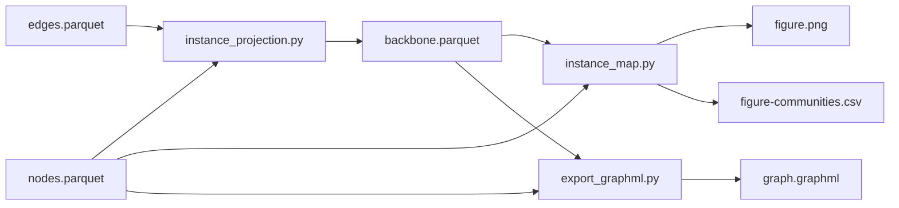

# community/

Community detection on the crawl snapshot, at two levels:

- **Actor level** — Leiden on the raw actor graph (`community_detection.py`,
  `structural_isolation.py`).
- **Instance level** — collapse the actor graph to a hostname-to-hostname graph
  first, then find communities of instances (`instance_projection.py`,
  `instance_map.py`, `export_graphml.py`).

The instance-level pipeline is the one that produces the community map figure.

## Running the scripts

All of these are plain scripts run through uv, from the
`pub-crawler-data-analysis` directory:

```bash
uv run python community/<script>.py <args>
```

`community_detection.py` and `structural_isolation.py` import `load_graph` from
the parent directory, so they need it on the import path. Either run them from
the parent directory as above with `PYTHONPATH` set:

```bash
PYTHONPATH=. uv run python community/community_detection.py <nodes> <edges>
```

...or run them from inside `community/` with `PYTHONPATH=..`.

Inputs are the snapshot Parquet files described in the top-level `CLAUDE.md`.
Loading a full snapshot takes several minutes and a lot of memory — develop
against a snowball sample (`parquet_snowball_sampler.py`) and only run the
snapshot when you want numbers for the paper.

## Instance-level pipeline



### instance_projection.py [nodes.parquet] [edges.parquet] [backbone.parquet]

Aggregates the actor graph into a directed instance graph. Every actor edge is
mapped to a `(src_hostname, dst_hostname)` pair and the pairs are counted.

Edges are streamed by row group (1M rows at a time) through an id → hostname
lookup array, so this runs on the full snapshot without loading the edge file
into memory.

Output columns:

| column | meaning |
| --- | --- |
| `src_hostname` | instance the follow originates from |
| `dst_hostname` | instance the follow points at |
| `weight` | number of actor-level edges between the two instances |
| `self_loop` | true when src == dst (intra-instance follows) |

Self-loops are kept but flagged, so downstream code can drop them. Actor edges
whose endpoint has a null hostname, or an id not present in the nodes file, are
dropped and reported in the log; an assertion checks that kept + dropped equals
the row count of the edges file.

### instance_map.py [backbone.parquet] [nodes.parquet] [figure.png]

The main script. Builds the filtered instance graph, runs Leiden on it, prints a
community table, and draws the map.

1. **Coverage filter** — drop instances with fewer than `min_actors` (100)
   crawled actors. Barely-crawled instances otherwise show up as noise.
2. **Mutual-follow backbone** — keep only pairs that follow each other in both
   directions, with the two directed weights summed. This is what stops the
   figure from collapsing into an in-degree starburst around the big hubs.
3. **Pruning** — keep the `top_k` (8) strongest mutual edges per instance, as a
   union over both endpoints, so an edge survives if either side ranks it.
4. **Weights** — `log1p` of the summed weight, so hub-to-hub edges don't
   dominate the layout.
5. Take the largest connected component, run Leiden
   (`ModularityVertexPartition`, seed 42, `n_iterations=-1`).

Outputs:

- The figure at the path you pass: force-directed (Fruchterman-Reingold) layout,
  node color = community, node size = log actor count, the 16 largest instances
  labelled. The title carries the community count and modularity Q.
- `<figure-basename>-communities.csv`: one row per community with instance
  count, actor count, modularity contribution `q_c`, and the four largest
  instances. Communities are renumbered by size, so community 0 is the largest.
  The `q_c` values sum to Q, which makes it easy to see which communities are
  actually carrying the partition.

Only the first 8 communities get a distinct color; the rest are drawn grey.

The seed is fixed at `SEED = 42` for both Leiden and the layout, so re-running
gives the same figure. Change it if you want to check the partition is stable.

### export_graphml.py

Writes the filtered instance graph to GraphML for use in Gephi or another
external layout tool. Same coverage filter as `instance_map.py`, but the graph
stays **directed** and pruning is plain top-5-by-weight per source, with no
mutual-edge requirement — so this is the raw backbone, not the map graph.

There is no command-line entrypoint; import and call it:

```python
from export_graphml import export
export("backbone.parquet", "nodes.parquet", "instance-map.graphml",
       min_actors=100, top_k=5)
```

Vertices carry an `actors` attribute (crawled actor count for that instance).

## Actor-level scripts

### community_detection.py [nodes.parquet] [edges.parquet]

Loads the actor graph and runs Leiden with `ModularityVertexPartition`, then
logs the node count and number of distinct instances each community spans.
Prints the community count. Also exports `partition(G)` for reuse.

Unweighted and unseeded, unlike the instance-level pipeline.

### structural_isolation.py [nodes.parquet] [edges.parquet]

Uses the same partition, then classifies every edge as internal to a community
or crossing between two, and reports per community:

| field | meaning |
| --- | --- |
| `size` | actors in the community |
| `instances` | distinct hostnames it spans |
| `internal_edges` | edges with both endpoints inside |
| `external_in_edges` / `external_out_edges` | crossing edges, by direction |
| `isolation_ratio` | `internal / (internal + external_in + external_out)` |

Results are logged sorted by isolation ratio, most isolated first. A ratio near
1 means a community that mostly talks to itself.

Note the denominator counts each crossing edge once for the source community and
once for the target, so the ratio is a relative measure for comparing
communities, not a share of a well-defined edge total.
